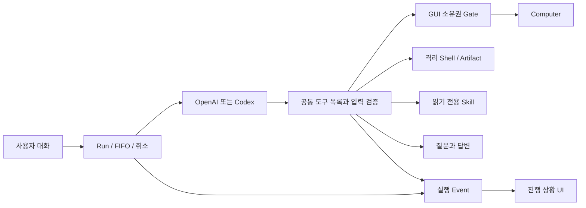

# OhMyDots Agents: 조사와 작은 아키텍처 실험

작성·소스 확인: 2026-10-06. 대상은 v0.0.1의 현재 코드와 사용자가 제공한 오픈소스 조사 자료다. 외부 프로젝트의 성능을 직접 벤치마크한 보고서는 아니다. 네 개의 독립 조사 결과를 먼저 모아 아래 두 구현을 결정했다. 고정 커밋·라이선스·코드 근거는 연결한 상세 문서에 있다.

## 결론과 이번 결정

현재 **Conversation → Run → provider → Tools → 격리된 Computer/Shell → Event → UI**를 유지한다. 이미 있는 FIFO, 질문/답변, 취소, 사용량, 스트리밍, GUI 제어권을 다른 프레임워크로 다시 만들 필요는 없다.

이번에 적용할 작은 기능은 두 개다.

1. **공통 Tool Registry와 실행 전 입력 검증.** OpenAI와 Codex MCP에 도구 이름·설명·JSON Schema를 한곳에서 제공한다. 모델이 잘못된 타입이나 추가 필드를 보내면 실제 실행 전에 거절한다. Registry는 공구 목록이고, JSON Schema는 그 공구에 맞는 입력 규격이다. 이것만으로 메일 발송 승인 같은 의미적 권한이 강제되는 것은 아니다.
2. **읽기 전용 내장 Skill 목록과 필요할 때 불러오기.** 모델은 `skills_list`에서 짧은 설명을 읽고 필요한 `skill_read`만 호출한다. 현재 작업에 도움이 되는 검증 절차를 재사용하면서 매번 모든 설명서를 context에 넣지 않는다. 임의의 경로·외부 설치·자동 수정은 제공하지 않는다. 기존 호스트 Codex 스킬 자동 탐색 차단도 유지한다.

첫 실험은 구조의 일관성과 검증, 두 번째는 그 구조로 실제 기능을 확장하는 경험을 얻기 위한 선택이다. Context 예산과 관찰 epoch 개선도 중요하지만 이번 두 실험에 묶어 큰 변경으로 만들지 않는다.

## 개념 지도

- **Runtime**: 작업을 시작하고 기다리고 취소하는 관리자.
- **Tool**: 클릭·명령 실행·파일 읽기처럼 프로그램이 실제로 할 수 있는 행동.
- **Skill**: 여러 도구를 어떤 순서와 기준으로 쓸지 설명하는 작업 설명서. 새로운 권한을 주는 실행 파일이 아니다.
- **Context**: 이번 모델 요청에 펼쳐 놓는 자료. 대화 DB 전체와 다르다.
- **Memory**: 다음 작업에도 사용할 사실. 출처·사용자 범위·수정·삭제가 필요한 별도 데이터다.
- **Grounding**: “검색 버튼”을 실제 좌표나 관찰된 요소 ID로 연결하는 과정.
- **Compute Session**: 작업하는 컴퓨터의 수명. 한 번의 Run과 수명이 같을 필요가 없다.

처음 읽는다면 [쉬운 설명과 학습 순서](AGENT-LEARNING-GUIDE.md)부터 읽으면 된다.

## 넓게 비교한 후보

아래 장단점과 우선순위는 확인한 소스를 OhMyDots에 대입한 설계 판단이다. 특정 프로젝트가 모든 상황에서 더 우수하다는 순위가 아니다.

| 후보 / 핵심 개념 | 장점 | 단점 또는 도입 비용 | 우리 적용 / 더 작은 대안 |
| --- | --- | --- | --- |
| Hermes / Registry·Skill | 도구 사용 가능 여부와 절차 설명서를 분리하고 필요할 때 내용 로딩 | 전체 runtime을 가져오면 현재 실행기·상태 관리와 중복 | 목록/본문 분리만 독립 구현. 지금 채택 |
| OpenHands SDK / 이벤트·context view | 원본 이벤트를 보존하면서 모델에게 줄 이력만 줄이는 구조 | 전체 SDK 이식과 이벤트 변환 비용; tool call/result 쌍 보존 필요 | 원본 DB 유지, 이후 Context Builder에서 제한·요약 구현 |
| smolagents / 간결한 Agent loop | 코드로 여러 작업을 묶는 개념과 작은 실행 흐름 이해에 좋음 | CodeAgent의 코드 실행 경계는 현재 제한된 GUI 입력과 다름 | 현재 provider loop 유지, 도구 입력 검증 강화 |
| nanobot / 명시적인 registry | 이름 기반 lookup·검증 패턴이 단순 | 프로젝트 전체가 항상 작다는 보장 없음 | 작은 정적 registry만 직접 구현 |
| Codex / 도구·스킬·승인 경계 | 스킬 발견과 내용 로딩 분리, 기존 로그인/provider 활용 | 코딩 sandbox 승인이 GUI 외부 변경 승인을 대신하지 않음 | app-server와 private MCP 유지, 내장 Skill 도구 추가 |
| Claude Code / hooks·subagents·skills UX | 작업 절차와 제한된 분업을 이해하는 좋은 제품 사례 | 핵심 엔진이 오픈소스로 공개된 것으로 취급하면 안 됨; hooks 운영 책임 | 공개 문서의 개념 참고, 현재 runtime에 필요한 작은 동작만 구현 |
| Letta / 지속적 memory | 세션이 끝나도 사용할 사실·출처를 관리하는 관점 | 오기억·오염·삭제·개인정보 범위와 검색 품질 관리 | 우선 명시적인 프로젝트 메모; 자동 학습은 나중 |
| OpenClaw / workspace·skill discovery | 파일 기반 설정과 절차 관리, 세션과 기억 구분 | 외부 skill 실행 권한과 workspace 경계 검토 필요 | 승인된 내장 파일만 읽는 catalog부터 시작 |
| UI-TARS / Operator | 모델 판단과 실제 OS 실행을 분리해 교체 가능 | TS/Electron 전체를 옮기면 Python stack과 중복 | observe / execute 경계와 공통 GUI Gate 보존 |
| Agent-S / 추론과 grounding 분리 | 작은 버튼 좌표 선택 모델을 따로 평가 가능 | 추가 호출·지연·모델 운영; pyautogui 직접 실행은 Gate 우회 | 좌표 후보만 받아 기존 입력기로 실행하는 실험을 후속 평가 |
| browser-use / 브라우저 구조 관찰 | 웹 양식·목록에서 DOM/AX가 좌표 추측을 줄일 수 있음 | 새 agent loop·취소·usage 중복, 사용자 화면과 다른 세션 위험 | 같은 컴퓨터에 제한된 Playwright/AX 어댑터를 나중에 연결 |
| E2B / 독립 compute 수명 | 사용자별 컴퓨터 생성·정리·자원 관리 확장 | 비용·프로필 영속성·세션 이관·네트워크 설계 필요 | 지금은 Docker 유지. 멀티 사용자 시 어댑터 후보로 평가 |
| OmniParser / 화면 요소 검출 | DOM 없는 앱과 아이콘을 목록으로 설명 가능 | GPU·모델 운영·좌표 변환; 코드/모델별 라이선스 구분 | 저장된 테스트 화면에서 관찰 품질부터 평가 |
| 사용자 Grok fork / 공통 스트림·MCP·반복 감지 | 여러 provider 출력을 통일하는 구조를 읽기 좋음 | 비공식 복원본, 원본 소스 재사용 라이선스 미부여; 전체 router 복잡 | 기존 공통 이벤트 유지, 패턴만 참고해 독립 구현 |

상세 근거: [Runtime 4종](research/runtime-sources.md), [Codex·Claude Code·Memory](research/coding-memory-sources.md), [Computer Use 5종과 대안](research/computer-sources.md), [현재 코드 12개 점검과 Grok](research/current-and-grok.md).

## 첨부 자료에서 보완해야 할 부분

1. 현재 새 Run에는 최근 **24개 메시지**가 들어간다. 무제한 대화 전달은 아니지만 길이 예산·요약 정책이 없어 긴 메시지 문제는 남는다. Run 내부 도구/이미지 이력은 provider 영역과 함께 봐야 한다.
2. 사용량의 누적 input tokens와 한 번의 요청 context 길이는 다르다. cache 관련 수치도 비용이나 무료 사용량으로 임의 환산하지 않는다.
3. Claude Code의 공개 저장소와 핵심 엔진의 오픈소스 공개는 다르다. 현재 Letta 구현 위치와 archive도 구분한다.
4. OmniParser는 확인한 커밋에서 README 배지와 루트 LICENSE가 불일치하며 모델 폴더별 조건도 다르다. “전부 MIT”나 “가중치 전부 AGPL”로 단정하지 않는다.
5. Grok fork는 공식 xAI 원본이 아닌 복원 프로젝트다. 코드·UI asset을 복사하지 않는다.
6. 질문 카드가 있다는 것과 서버가 특정 외부 변경을 승인 없이는 실행할 수 없게 막는 것은 다르다. 현재 자연어 지침의 한계를 명시하고, 구조화된 외부 앱 도구를 만들 때 payload에 묶인 approval ticket을 함께 설계한다.

## 현재 구조 점검 요약

| 판단 | 항목 |
| --- | --- |
| KEEP | Runtime/provider 역할 분리, Conversation/Run/Compute 구분, FIFO, GUI Gate/epoch, 격리 셸, 스트림·사용량·tool call ID, 보수적인 재시작 실패/재시도 |
| CHANGE NOW | OpenAI/MCP 중복 tool schema, 실행 전 입력 검증; 명시적 내장 Skill catalog 추가 |
| CHANGE NEXT | 관찰 당시 epoch와 행동 바인딩, context 길이 예산·trim 관측, 앱 도구별 실제 승인 규약 |
| ADD LATER | DOM/AX browser adapter, memory provenance·삭제, durable computer profile, per-compute queue, 제한된 조사 subagent, 평가 후 grounding 모델 |

12개 항목의 코드 위치와 기존 테스트 근거는 [현재 구조 조사](research/current-and-grok.md)에 있다.

## 다음 로드맵과 완료 판정

**다음 패치 — 관찰과 context.** screenshot 관찰 시점의 epoch/ID를 행동에 붙인다. Take over→Return control이 모두 끝난 뒤에도 예전 화면의 좌표가 새 epoch로 실행되지 않는 회귀 테스트가 필요하다. 이는 이번 Registry/Skill만으로 해결되는 문제가 아니다. Context Builder는 최신 요청과 tool call/result 쌍을 보존하고, 제외한 자료를 이벤트로 알리며 원본 대화는 보존해야 한다.

**웹 작업 강화 — 같은 화면의 구조 관찰.** 먼저 AX/DOM 읽기, 이후 제한된 실행기를 연결한다. 실제 부작용 실행 지점이 기존 소유권 Gate를 통과해야 한다. 임의 CDP 포트나 무제한 JS 실행이 Gate를 우회하지 않도록 설계한다. 로그인 없는 테스트 페이지에서 화면·결과·인계·취소를 반복 검증한다.

**지속성 — 기억과 컴퓨터 수명.** Run 재시작과 컴퓨터 재시작을 구분한다. 현재 API 재시작으로 GUI에 재연결할 수 있어도 컨테이너 tmpfs가 영속되는 것은 아니다. 사용자별 scope, 출처, 갱신 시각, 삭제 기능부터 memory를 만들고 그다음 검색을 추가한다.

**분업 — 한 컴퓨터에 여러 손을 붙이지 않는다.** 읽기 전용 조사 subagent부터 제한된 도구·횟수/비용·취소 전파·결과 출처를 정의한다. 여러 컴퓨터가 생기면 compute별 queue/lease를 도입한다.

비교 지표는 성공 여부, 사용자가 개입한 횟수, 잘못된 부작용, 총 호출/토큰, 지연, 취소 후 남은 작업이다. 모델 이름이나 벤치마크 수치만으로 제품 성공률을 주장하지 않는다.

## 이번 검증 계획

Registry: schema 동등성, 잘못된 enum/타입/추가 필드 거절, 기존 취소·이벤트·GUI 인계 회귀, 실제 MCP 연결. Skill: 허용된 ID만 읽기, 경로 탈출 방지, 목록에 본문 미포함, 내용 크기 제한, 실제 provider의 목록→읽기→결과 검증. OpenAI API 키가 없는 경우 테스트한 adapter 경로와 실제 Codex 실행을 분리해 기록한다.
