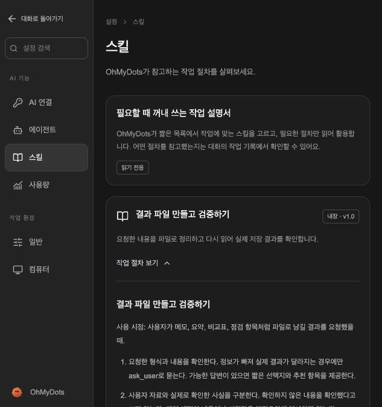
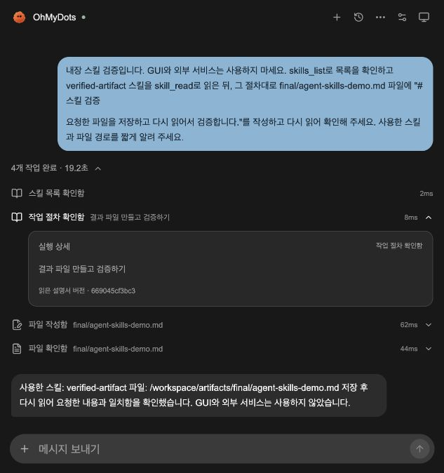

# Agent 기반 개선: 구현과 검증

2026-10-06. [조사와 결정](AGENT-ARCHITECTURE.md)을 먼저 커밋한 뒤 두 기능을 구현했다. 외부 framework 소스나 복원 코드를 복사하지 않고 현재 실행기 안에서 독립 구현했다.

## 1. 공통 Tool Registry

`apps/api/ohmydot/tool_registry.py`가 도구 이름·설명·입력 JSON Schema의 원본이다. OpenAI FunctionTool이 같은 정의를 사용하고, Codex의 private MCP bridge는 활성 Run 토큰으로 `GET /internal/runs/{run_id}/tools`를 읽어 같은 목록을 제공한다.

두 provider 모두 `Tools.invoke`를 거친다. 서버는 실행 전에 입력 타입, enum, 필수 필드, 추가 필드, 질문 선택지 길이 등을 검사한다. 오류는 값이나 임의 필드명을 노출하지 않는 짧은 설명으로 반환하고, 실제 도구는 실행하지 않는다. 실패도 기존 call ID로 시작/실패 이벤트가 짝을 이루며 같은 실패 반복 시 기존 중단 규칙을 적용한다.

MCP 함수 signature와 OpenAI schema를 각각 수정하던 중복이 사라졌다. optional 필드는 임의의 `None`이나 기본값을 넣지 않고 전달한다. 따라서 `ask_user`에서 선택지를 생략한 호출도 일관되게 처리한다.

현재 registry는 **등록된 정적 도구 목록**이다. 도구가 목록에 있다고 해당 컴퓨터의 연결이 보장되거나 모든 행동을 승인받은 것은 아니다. 동적인 availability/설치·검색, 의미적 외부 변경 승인 게이트는 이번 기능에 포함하지 않았다.

## 2. 필요한 내장 Skill만 읽기

`skills_list`는 ID·제목·짧은 설명·버전만 반환한다. `skill_read`는 목록의 ID로 절차 본문을 읽고 SHA-256 내용 버전을 함께 반환한다. ID는 코드의 목록에 있는 값만 허용하므로 임의 파일 경로나 외부 스킬을 읽지 않는다. 각 본문은 16 KiB 이하다.

현재 설명서:

- `verified-artifact`: 파일 작성 → 다시 읽기 → 요청한 내용과 대조.
- `careful-computer-task`: 화면 관찰 → 짧은 행동 → 제어권/확인 절차 → 실제 결과 검증.

설정의 **스킬**에서 목록과 절차를 읽을 수 있다. 에이전트가 읽으면 작업 기록에 스킬 제목과 읽은 시점의 내용 해시를 남긴다. 전체 본문은 실행 이벤트에 중복 저장하지 않는다. SHA는 내용 변경을 구분하는 값이며 신뢰할 수 있는 서명이나 권한 증명은 아니다.

스킬은 작업 설명서이므로 도구 실행 권한·사용자 동의·OS 격리를 대신하지 않는다. 자동 학습, 임의 설치, 호스트 스킬 탐색, 사용자 기억 저장 기능은 추가하지 않았다.

## 검증 결과

| 범위 | 결과와 근거 |
| --- | --- |
| Python 전체 | `.venv/bin/pytest -q`: **48 passed**. 기존 FIFO/취소/질문/GUI 제어권/스트림 회귀 포함 |
| Registry | 잘못된 enum·타입·추가 필드·선택지·bool을 integer로 보낸 경우 거절, 실행 함수 미호출, 오류/이벤트 비밀값 비노출 |
| Provider 규격 | OpenAI FunctionTool schema와 Registry 일치. 실제 stdio MCP initialize/list/call로 같은 schema, 선택지 생략, 오류, 이미지 content 변환 확인 |
| Skill | 요약에 본문 미포함, 허용 ID만 읽기, 경로 입력 사전 거절, 16 KiB 제한, 해시와 이벤트 일치, API 인증/다른 origin 거절 |
| 웹 | 기존 **13 tests passed**, TypeScript 검사와 Next production build 성공, Ruff 및 diff-check 통과 |
| 실제 모델 | 연결된 Codex로 새 대화에서 아래 4단계 수행. **19.2초, COMPLETED** |
| 실제 UI | 설정 스킬 목록/본문, 실행 기록 제목/버전 표시 확인. 새로고침 후 4개 작업과 스킬 버전 복원, 중복 없음 |

실제 Run: `b7f18e80-a10b-448a-a888-823a27070b94`.

```text
skills_list → skill_read(verified-artifact)
            → artifact_write(final/agent-skills-demo.md)
            → artifact_read(final/agent-skills-demo.md)
```

작성 후 읽은 파일 내용이 요청한 문장과 같은지 DB의 도구 완료 이벤트로도 대조했다. Skill 해시도 실제 내장 파일의 해시와 일치했다. 이 실험은 GUI·개인 계정·외부 전송을 사용하지 않았다.

OpenAI API 키는 연결되어 있지 않아 **실제 OpenAI 호출은 하지 않았다**. OpenAI 쪽은 adapter/동일 schema/호출 전달 테스트, Codex 쪽은 실제 인증된 실행으로 검증했다. 모델이 항상 적절한 Skill을 스스로 선택하는지, 토큰 비용이나 작업 성공률이 개선됐는지까지 측정한 실험은 아니다.

검증 중 API와 웹만 재시작했고 진행 Run이 없는 것을 먼저 확인했다. computer/shell 컨테이너는 재생성하지 않았다.

## 화면





## 코드를 읽는 순서

1. `tool_registry.py`: 모델에 알려 주는 도구 규격과 서버의 입력 검사.
2. `skills.py`와 `builtin_skills/`: 짧은 목록과 요청 시 읽는 본문.
3. `tools.py`: 취소 확인 → 입력 검사 → 실행 → 결과/실패 이벤트.
4. `providers.py`와 `mcp_bridge.py`: 같은 기능을 서로 다른 provider에 연결.
5. `SkillsCatalog.tsx`와 `RunActivity.tsx`: 설정의 설명서와 실제 사용 이력.
6. `tests/test_registry.py`, `tests/test_skills.py`: 잘못된 요청이 실행되지 않는지 확인.

다음 우선순위는 관찰 당시 epoch/ID와 GUI 행동 바인딩, context 길이 예산이다. Registry/Skill을 추가했다고 기존의 모든 GUI freshness 문제나 외부 변경의 의미적 승인 문제가 해결된 것으로 간주하지 않는다.
