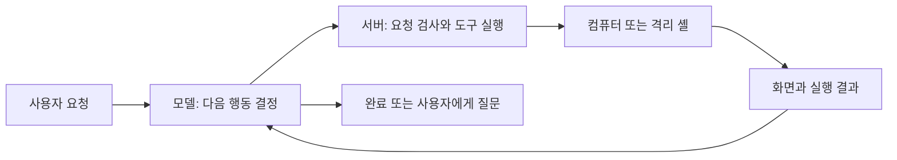

# OhMyDots 에이전트, 처음부터 이해하기

이 자료는 2026-10-06의 OhMyDots 코드를 출발점으로 설명합니다. 라이브러리 이름을 외우기보다 **누가 결정하고, 누가 실행하며, 무엇을 기록하는지**를 구분하는 것이 먼저입니다.

## 1. 채팅 모델과 에이전트는 무엇이 다른가요?

채팅 모델은 질문에 답변을 만듭니다. 에이전트는 답변이 부족하면 도구를 호출하고, 결과를 관찰한 뒤 다음 행동을 결정하는 프로그램입니다. 모델이 실제 마우스를 움직이는 것은 아닙니다. 모델은 클릭을 요청하고, 우리 서버가 입력을 검사하고, 컴퓨터 서비스가 마우스를 움직입니다.

`while` 루프 자체보다 중요한 것은 종료·취소·사용자 질문·실패를 어떻게 처리하느냐입니다. 성공 문장을 출력했다고 성공이 되는 것도 아닙니다. 예를 들어 파일을 만들었다면 다시 읽어서 내용까지 확인해야 합니다.

## 2. 꼭 구분할 여덟 가지

| 개념 | 쉬운 비유 | OhMyDots에서의 의미 |
|---|---|---|
| Model | 다음 행동을 생각하는 사람 | Codex/OpenAI가 도구 호출이나 답변을 생성 |
| Runtime | 작업 진행을 관리하는 담당자 | 작업 시작, 시간 제한, 대기, 취소와 완료 관리 |
| Tool | 사용할 수 있는 손과 도구 | 화면 보기, 클릭, 명령 실행, 파일 읽기 등 |
| Context | 이번 작업 때 책상 위에 펼친 자료 | 현재 요청, 관련 대화, 도구 결과, 필요한 절차 |
| Skill | 작업 설명서 | 특정 일을 수행하는 재사용 가능한 절차 |
| Memory | 별도로 보관하는 사실 기록 | 사용자 선호나 환경 정보. 틀릴 수 있어 확인·삭제 필요 |
| Event | 시간순 작업 일지 | 어떤 도구가 언제 시작·완료·실패했는지 기록 |
| Policy | 실행 전에 확인하는 규칙 | 실행 허용, 사용자 확인 요구, 실행 거부 |

설명서는 권한증이 아닙니다. Skill에 “메일 보내기”가 있어도 사용자 승인이나 서버 권한 검사를 대신할 수 없습니다. 웹페이지·메일·문서 안의 명령문도 사용자의 요청으로 취급하면 안 됩니다.

## 3. Conversation, Run, Compute는 왜 나누나요?

“이번 회의를 준비해 줘”라는 대화는 여러 날 이어질 수 있습니다. 한 번의 실행은 몇 분 안에 끝나거나 취소될 수 있습니다. 브라우저와 작성 중인 문서는 그 뒤에도 남아 있어야 합니다.

- **Conversation:** 사용자와 나눈 대화 묶음.
- **Run:** 요청 한 번을 처리하는 실행. 재시도는 별도 실행으로 기록할 수 있습니다.
- **Compute:** 브라우저·창·파일이 존재하는 실제 환경.
- **Browser session:** 로그인과 탭 상태를 가진 브라우저 세션. 향후 별도 수명 관리가 필요합니다.

Take over는 마우스·키보드 제어권을 사용자에게 넘깁니다. Cancel은 에이전트 작업을 중단합니다. 제어권을 돌려준 뒤에는 예전 화면 좌표를 그대로 쓰지 않고 새 화면을 확인해야 합니다.

## 4. 도구 목록과 도구 실행은 다른 책임입니다

모델에 보여주는 것은 도구의 이름·설명·입력 형식입니다. 실제 함수와 권한은 서버가 관리합니다. “현재 사용할 수 있는가?”와 “이 행동을 실행해도 되는가?”도 다릅니다.

예를 들어 브라우저가 연결되어 있어도 사용자가 제어 중이면 에이전트 입력은 기다려야 합니다. 메일 앱에 접속할 수 있어도 초대장을 보내라는 승인을 받았다는 뜻은 아닙니다.

JSON Schema/Pydantic은 입력 형식을 검사하는 데 도움이 됩니다. 하지만 `click(x=100, y=200)`만 보고 그 버튼이 검색인지 결제인지 알아낼 수는 없습니다. 화면 좌표 도구만 있는 단계에서 “모든 외부 전송을 서버가 완벽히 차단한다”고 말하면 안 됩니다.

## 5. 컨텍스트와 사용량을 읽는 방법

컴퓨터 에이전트는 화면을 자주 보므로 입력이 빠르게 커집니다. 이전 자료를 다음 요청에도 다시 넣으면 같은 자료가 여러 번 입력 토큰으로 집계될 수 있습니다.

- **누적 입력 토큰:** 여러 모델 요청에 걸친 입력의 합. 현재 한 요청의 컨텍스트 길이와 다릅니다.
- **캐시 입력:** 제공자가 재사용했다고 보고한 입력 부분. 정확한 비용 계산에는 모델별 요금과 보고 규칙이 필요합니다.
- **컨텍스트 윈도:** 한 요청에서 모델이 읽을 수 있는 최대 범위.
- **요약/압축:** 일부 정보를 더 짧게 재구성. 중요한 조건을 빠뜨릴 위험이 있습니다.
- **제한/선택:** 필요한 최근 항목을 남기고 일부를 빼는 방식. 요약과 구분해야 합니다.

따라서 100만 입력 토큰이 표시된다고 한 번의 요청에 100만 토큰을 넣었다고 단정할 수 없습니다. 먼저 요청 횟수, 이미지 크기, 도구 출력량과 캐시 사용량을 함께 봐야 합니다.

## 6. 스크린샷과 DOM/AX는 무엇이 다른가요?

스크린샷은 눈으로 보는 화면이고, DOM은 웹 문서의 구조, AX tree는 버튼·입력칸 등의 접근성 정보를 담은 구조입니다. Grounding은 “설정 버튼”이라는 의미를 실제 요소나 좌표에 연결하는 과정입니다.

구조화된 요소가 안정적이면 웹 자동화에 유리하고, 일반 데스크톱 앱이나 캔버스에서는 이미지가 필요합니다. 둘을 섞는 방식은 유용하지만, 경로마다 제어권·권한·세션·관찰 시점 검사를 동일하게 적용해야 합니다.

## 7. 먼저 공부할 순서

| 순서 | 공부할 것 | 작은 실습 | 이해했다는 기준 |
|---|---|---|---|
| 1 | Python `async`/`await`, HTTP, JSON | 시간이 걸리는 함수를 취소해 보기 | 취소와 실패, 대기를 구분해 설명 |
| 2 | Tool calling과 JSON Schema | 파일 읽기 도구 하나 연결 | 잘못된 입력이 실행 전에 거절됨 |
| 3 | 상태 머신과 데이터베이스 | 실행 상태 전이를 표로 작성 | 중복 제출·재시작 상황을 설명 |
| 4 | 이벤트와 스트리밍 | 이벤트를 저장하고 다시 표시 | 새로고침해도 중복 없이 복원 |
| 5 | 컨텍스트·토큰·평가 | 짧은/긴 요청의 입력량 비교 | 누적 사용량과 한 요청 길이를 구분 |
| 6 | Skills와 검색 | 설명서 목록과 본문 로딩 분리 | 필요 없는 본문을 모델에 넣지 않음 |
| 7 | 컴퓨터 제어·DOM·AX | 같은 버튼을 이미지/요소로 찾기 | 오래된 좌표가 왜 위험한지 설명 |
| 8 | 권한·승인·격리 | 실행 직전 승인과 취소 경합 시험 | 승인되지 않은 요청을 서버가 거절 |
| 9 | 장기 메모리·평가 데이터 | 확인된 선호만 저장·수정·삭제 | 기억의 출처와 적용 범위를 설명 |
| 10 | 여러 에이전트 | 읽기 전용 조사 두 개를 병렬 실행 | 충돌·중복 실행·비용을 측정 |

처음부터 프레임워크 전체를 읽지 않아도 됩니다. 작은 도구 하나가 “모델 요청 → 검증 → 실행 → 결과 → 이벤트”로 이동하는 경로를 먼저 따라가세요. 오픈소스 코드 읽기 경로와 프로젝트별 장단점은 [아키텍처 검토](AGENT-ARCHITECTURE.md) 및 하위 조사 노트에 정리합니다.
