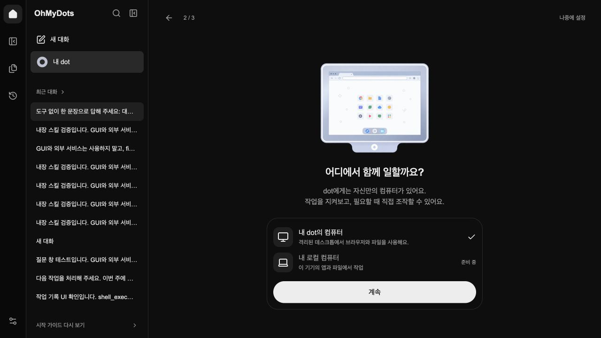
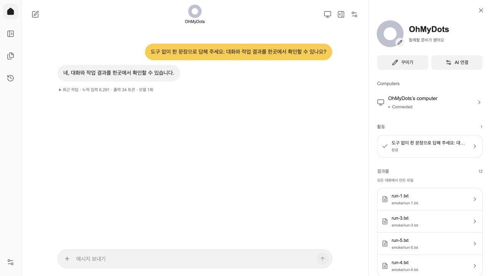
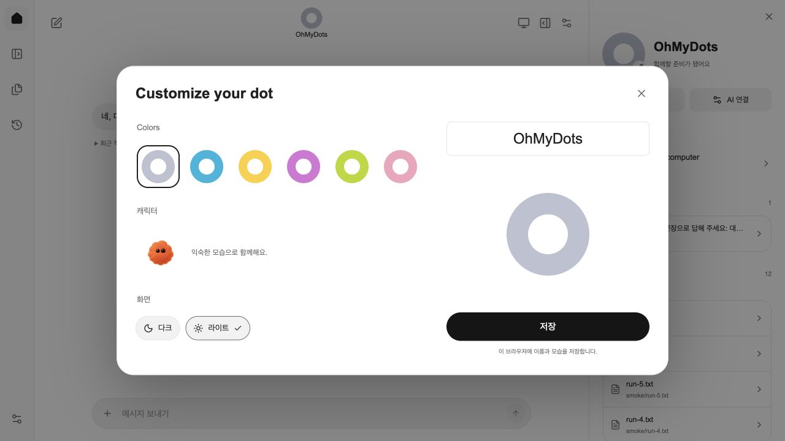

# OhMyDots의 대화와 시작 경험

## 시작부터 작업까지

첫 화면에서 Codex / OpenAI API의 연결 상태와 컴퓨터 준비 상태를 확인하고, 작업 환경을 살펴본 뒤 이름·색상·캐릭터·화면 테마를 고릅니다. 중간 단계는 브라우저에 저장되어 새로고침 후 이어집니다. `나중에 설정`으로 대화에 들어가거나, 탐색 메뉴의 `시작 가이드 다시 보기`로 돌아올 수 있습니다.

대화 옆에는 프로필, 컴퓨터 연결 상태, 현재 대화의 작업, 전체 작업 공간의 결과 파일이 있습니다. 활동을 누르면 요청과 실행 기록을 확인하고, 파일을 누르면 오른쪽 문서 화면에서 내용을 읽습니다. 컴퓨터를 열면 대화 약 37%, 컴퓨터 약 63%의 분할 화면으로 전환합니다. 좁은 화면에서는 컴퓨터와 대화를 전환하며, 프로필은 접을 수 있는 패널이 됩니다.

`Customize your dot`에서 여섯 색상의 링 또는 기존 OhMyDots 캐릭터, 이름, 다크·라이트 테마를 선택합니다. 저장 전 편집은 취소할 수 있습니다. 이름과 모습은 `ohmydots-profile-v1`에 저장하는 이 브라우저의 표시 설정입니다. 모델 프롬프트나 서버 계정 이름을 변경하지 않습니다.

## 참조와 적용

사용자가 제공한 10개 이미지가 시각적 기준입니다. 앱 바깥의 macOS 메뉴/Dock, Chrome 탭, 영상 플레이어는 앱 UI에 포함하지 않았습니다.

| 참조 | 확인한 내용 | 적용 |
| --- | --- | --- |
| 연결 온보딩 스크린샷 | 중앙 링, 짧은 설명, 연결 목록, 흰색 Continue | 실제 Codex/OpenAI/Browser/Files 상태로 같은 정보 구조 구성 |
| 컴퓨터 선택 스크린샷 | 모니터 이미지, 작업 환경 카드, 하단 CTA | 별도 생성한 모니터 일러스트와 격리 컴퓨터 안내 |
| 어두운 채팅+컴퓨터 스크린샷 | 좁은 아이콘 레일, 중앙 프로필, 말풍선, 넓은 컴퓨터, 아래 제어권 버튼 | 실행·입력·스트리밍 로직을 유지하면서 배치와 크기 조정 |
| 밝은 프로필/꾸미기 스크린샷 | 이름·상태·컴퓨터·활동·결과물, 좌측 선택/우측 미리보기 | 실제 작업과 파일, 이름/모습 편집 및 저장 |
| 밝은 Activity/Outputs 스크린샷 | 노란 사용자 말풍선, 회색 답변, 오른쪽 작업 목록 | 라이트 테마 및 활동 상세 |
| 문서 화면 스크린샷 | 문서 제목과 넓은 읽기 공간 | 결과 파일을 옆 패널에서 Markdown 또는 텍스트로 표시 |
| Slack 스크린샷 | 외부 채널에서 에이전트 호출 | 향후 연결 기능의 참고 자료로만 보관 |

[첫 영상](https://www.youtube.com/watch?v=MhrH8oGVwiI)은 자막의 0:44–1:19에서 컴퓨터 연결과 이름·캐릭터 편집 순서를 확인했습니다. [두 번째 영상](https://www.youtube.com/watch?v=JUnPS2i954o)은 자막의 5:06–6:28에서 컴퓨터 선택→이름 선택→프로필/활동/결과물 구성을 확인했습니다. 자동 자막에는 인식 오류가 있어 시각 배치는 첨부 스크린샷을 우선했습니다. [세 번째 영상](https://www.youtube.com/watch?v=P2OGf7jqtOU)은 페이지와 제목·설명은 확인했으나 자막을 가져오지 못했고, 재생 시 광고가 나와 전체 영상 검토를 완료했다고 간주하지 않았습니다.

아이콘은 [Lucide](https://lucide.dev/icons/panel-left)와 [Phosphor](https://phosphoricons.com/)를 비교한 뒤 기존 Lucide의 얇은 선 아이콘을 유지했습니다. 서체는 [Inter](https://rsms.me/inter/)도 검토했으나 현재 앱의 Arial/시스템 한글 서체로 통일하여 외부 폰트 요청을 추가하지 않았습니다. 모니터는 imagegen으로 만든 1448×1086 투명 PNG이고 캐릭터는 기존 `dot-pet.png`를 재사용합니다.

## 구현 범위

- 실제로 연결하지 않은 Google/Slack 계정을 `Connected`로 표시하지 않습니다.
- 로컬 기기 제어는 `준비 중`으로 표시합니다. 전화, Slack, Google OAuth, 예약 작업 기능을 이 UI 변경에 새로 구현하지 않았습니다.
- 결과물 목록은 전체 작업 공간의 파일이며, 현재 대화의 파일만인 것처럼 표시하지 않습니다.
- 컴퓨터 내부의 기존 바탕화면, 브라우저 세션, Dock과 제어권 검증을 유지합니다.
- 시작 가이드/커스터마이즈는 AI 호출 없이 동작합니다.

## 검증

- 웹 테스트 15개, TypeScript, Next.js production build 통과.
- 실제 localhost:3080 브라우저에서 단계 이동/새로고침 복원/완료/재진입/건너뛰기, 이름·모습 저장과 Escape 취소, 다크·라이트 전환, 대화 검색, 메시지 전송/활동 갱신, 파일 미리보기, 컴퓨터 열기/확장/제어권 가져오기·반환 확인.
- 메시지 확인 1회: 모델 호출 1회, 입력 6,291 / 출력 34토큰. 이 수치는 해당 요청의 사용량이며 일반적인 비용 추정이 아닙니다.
- 데스크톱 1280×720과 좁은 화면 492×674에서 확인. 콘솔 error/warn 없음. 상세 비교와 한계는 루트 `design-qa.md`에 기록했습니다.

