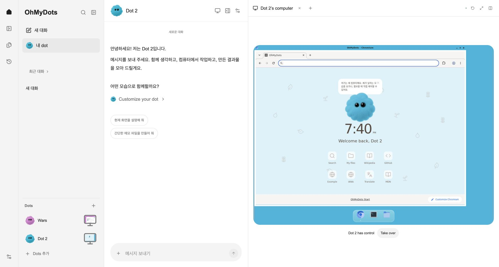

# OhMyDots의 대화와 시작 경험

## 시작부터 작업까지

첫 화면에서 Codex / OpenAI API의 연결 상태와 컴퓨터 준비 상태를 확인하고, 작업 환경을 살펴본 뒤 이름·색상·캐릭터·화면 테마를 고릅니다. 중간 단계는 브라우저에 저장되어 새로고침 후 이어집니다. `나중에 설정`으로 대화에 들어갈 수 있습니다. 탐색 메뉴 하단에는 Dots 목록과 `Dots 추가`가 있습니다.

대화 옆에는 프로필, 컴퓨터 연결 상태, 현재 대화의 작업, 전체 작업 공간의 결과 파일이 있습니다. 활동을 누르면 요청과 실행 기록을 확인하고, 파일을 누르면 Spaces 화면에서 내용을 읽습니다. 파일 검색과 문서·이미지·기타 필터로 결과물을 찾을 수 있습니다. 컴퓨터를 열면 대화 약 37%, 컴퓨터 약 63%의 분할 화면으로 전환합니다. 좁은 화면에서는 컴퓨터와 대화를 전환하며, 프로필은 접을 수 있는 패널이 됩니다.

`Customize your dot`에서 여섯 색상의 링 또는 기존 OhMyDots 캐릭터, 이름, 다크·라이트 테마를 선택합니다. 저장 전 편집은 취소할 수 있습니다. 이름·색상·캐릭터는 Dot별 서버 프로필에 저장합니다. 화면 테마와 초기 설정 진행 단계는 이 브라우저에 저장합니다. 저장한 이름은 다음 요청의 모델 지침과 해당 Dot의 컴퓨터 시작 화면에 적용합니다.

## 참조와 적용

사용자가 제공한 10개 이미지가 시각적 기준입니다. 앱 바깥의 macOS 메뉴/Dock, Chrome 탭, 영상 플레이어는 앱 UI에 포함하지 않았습니다.

| 참조 | 확인한 내용 | 적용 |
| --- | --- | --- |
| 연결 온보딩 스크린샷 | 중앙 링, 짧은 설명, 연결 목록, 흰색 Continue | 실제 Codex/OpenAI/Browser/Files 상태로 같은 정보 구조 구성 |
| 컴퓨터 선택 스크린샷 | 모니터 이미지, 작업 환경 카드, 하단 CTA | 별도 생성한 모니터 일러스트와 격리 컴퓨터 안내 |
| 어두운 채팅+컴퓨터 스크린샷 | 좁은 아이콘 레일, 중앙 프로필, 말풍선, 넓은 컴퓨터, 아래 제어권 버튼 | 실행·입력·스트리밍 로직을 유지하면서 배치와 크기 조정 |
| 밝은 프로필/꾸미기 스크린샷 | 이름·상태·컴퓨터·활동·결과물, 좌측 선택/우측 미리보기 | 실제 작업과 파일, 이름/모습 편집 및 저장 |
| 밝은 Activity/Outputs 스크린샷 | 노란 사용자 말풍선, 회색 답변, 오른쪽 작업 목록 | 라이트 테마 및 활동 상세 |
| 문서 화면 스크린샷 | 문서 제목과 넓은 읽기 공간 | 결과 파일을 옆 패널에서 Markdown 또는 텍스트로 표시 |
| Slack 스크린샷 | 외부 채널에서 에이전트 호출 | 설정에서 Slack 웹 로그인과 컴퓨터 사용을 제공하며 채널 봇/API 연동은 후속 과제 |

[첫 영상](https://www.youtube.com/watch?v=MhrH8oGVwiI)은 자막의 0:44–1:19에서 컴퓨터 연결과 이름·캐릭터 편집 순서를 확인했습니다. [두 번째 영상](https://www.youtube.com/watch?v=JUnPS2i954o)은 자막의 5:06–6:28에서 컴퓨터 선택→이름 선택→프로필/활동/결과물 구성을 확인했습니다. 자동 자막에는 인식 오류가 있어 시각 배치는 첨부 스크린샷을 우선했습니다. [세 번째 영상](https://www.youtube.com/watch?v=P2OGf7jqtOU)은 페이지와 제목·설명은 확인했으나 자막을 가져오지 못했고, 재생 시 광고가 나와 전체 영상 검토를 완료했다고 간주하지 않았습니다.

아이콘은 [Lucide](https://lucide.dev/icons/panel-left)와 [Phosphor](https://phosphoricons.com/)를 비교한 뒤 기존 Lucide의 얇은 선 아이콘을 유지했습니다. 서체는 [Inter](https://rsms.me/inter/)도 검토했으나 현재 앱의 Arial/시스템 한글 서체로 통일하여 외부 폰트 요청을 추가하지 않았습니다. 모니터는 imagegen으로 만든 1448×1086 투명 PNG이고 캐릭터는 기존 `dot-pet.png`를 재사용합니다.

## 구현 범위

- 실제로 연결하지 않은 Google/Slack 계정을 `Connected`로 표시하지 않습니다.
- 로컬 기기 제어는 `준비 중`으로 표시합니다. 전화, Google·Slack OAuth/API, 예약 작업은 제공하지 않습니다. Gmail·Calendar·Drive·Slack은 dot 컴퓨터의 브라우저에서 로그인하여 사용합니다.
- 결과물 목록은 전체 작업 공간의 파일이며, 현재 대화의 파일만인 것처럼 표시하지 않습니다.
- 컴퓨터 내부의 기존 바탕화면, 브라우저 세션, Dock과 제어권 검증을 유지합니다.
- 시작 가이드/커스터마이즈는 AI 호출 없이 동작합니다.

## 검증

- 웹 테스트 15개, TypeScript, Next.js production build 통과.
- 실제 localhost:3080 브라우저에서 단계 이동/새로고침 복원/완료/재진입/건너뛰기, 이름·모습 저장과 Escape 취소, 다크·라이트 전환, 대화 검색, 메시지 전송/활동 갱신, 파일 미리보기, 컴퓨터 열기/확장/제어권 가져오기·반환 확인.
- 메시지 확인 1회: 모델 호출 1회, 입력 6,291 / 출력 34토큰. 이 수치는 해당 요청의 사용량이며 일반적인 비용 추정이 아닙니다.
- 데스크톱 1280×720과 좁은 화면 492×674에서 확인. 콘솔 error/warn 없음. 상세 비교와 한계는 루트 `design-qa.md`에 기록했습니다.

## 설정·앱 연결·Spaces (2026-10-07)

실제 ChatGPT 웹의 설정, 앱 목록, Gmail 연결 상세 화면을 컴퓨터 사용 도구로 확인하고 스크린샷을 남겼습니다. Codex 네이티브 앱은 도구의 접근 제한으로 직접 확인하지 못했으며, 사용자가 첨부한 변경 사항·하위 에이전트·소스 팝업을 참고했습니다. 기존 활동과 파일을 유지하면서 설정은 왼쪽 탐색/오른쪽 내용, 앱은 검색 가능한 카드/상세 화면, 결과물은 파일 목록/미리보기로 구성했습니다.

- 모델은 직접 입력 대신 검색 가능한 선택 목록입니다. Codex 로컬 목록과 OpenAI API 모델 조회를 사용하며 목록 오류 시 현재 설정을 유지합니다. 키는 서버에서만 모델 조회에 사용합니다.
- 앱 상세의 로그인 버튼은 컴퓨터를 열고 사용자에게 제어권을 넘깁니다. 서비스 로그인 뒤 Return control로 작업을 이어갑니다. 로그인 여부를 확인하지 않고 Connected로 표시하지 않습니다.
- Spaces에서 Markdown·텍스트·이미지·PDF를 미리 보고 원본을 다운로드합니다. 텍스트 미리보기는 64 KiB, 원본은 20 MiB까지 지원하며 작업 공간 바깥 파일과 심볼릭 링크는 차단합니다.
- 실제 브라우저에서 모델 선택 목록·검색·새로고침, 앱 검색·상세·Google 로그인 화면 열기와 제어권 인계, Spaces 검색·Markdown 미리보기·원본 다운로드를 확인했습니다. Python 65개, 웹 15개 테스트, Ruff, TypeScript와 프로덕션 빌드를 통과했습니다.

## 여러 Dots와 컴퓨터 미리보기 (2026-10-07)

탐색 하단의 `Dots 추가`에서 이름·색상·캐릭터를 골라 Dot을 추가합니다. 목록에서 Dot을 전환하면 해당 Dot의 대화·결과 파일·컴퓨터를 불러옵니다. 기존 Dot의 대화와 파일은 그대로 유지됩니다.

- Dot마다 독립된 desktop/shell 컨테이너와 artifacts/home/tools 볼륨을 만듭니다. 새 Dot의 Chromium 프로필과 설치한 셸 도구도 별도로 저장합니다.
- 기존 컴퓨터·셸의 Docker 이미지, 네트워크와 리소스 제한을 사용합니다. API 서버가 Docker CLI 및 `ohmydot` Compose 배포에 접근할 수 있어야 합니다. 현재 생성 한도는 8개입니다.
- 추가 컨테이너의 포트는 로컬 루프백에만 바인딩됩니다. 브라우저는 인증된 API를 통해 화면과 입력에 접근합니다. 이는 한 사용자의 여러 컴퓨터이며 별도 사용자 테넌트 간 보안 경계를 제공하는 기능은 아닙니다.
- 목록과 Computers 카드의 모니터 안에는 실제 PNG 화면을 표시합니다. 표시 시, 5분 간격, 숨겨진 탭이 다시 보일 때 갱신합니다. 컴퓨터를 열면 기존 VNC 실시간 화면을 사용합니다.
- Google/Slack 연결과 AI 제공자 설정은 계정 공통입니다. 앱의 `컴퓨터에서 열기`는 현재 선택한 Dot의 컴퓨터를 사용합니다.
- Dot별 생성 작업, 질문, 취소, 제어권, 스크린샷, 파일 다운로드를 해당 런타임으로 전달합니다. 재시작 시 중단된 작업의 셸 취소도 올바른 Dot으로 전달합니다.

실제 두 번째 Dot을 생성해 서로 다른 PNG 화면, 분홍/하늘 색상, 대화 전환, 기존 파일 14개와 새 Dot의 빈 파일 목록을 확인했습니다. 새 Dot에 만든 임시 파일이 기존 Dot에서 조회되지 않음을 검증하고 해당 임시 파일을 삭제했습니다. 서버 재시작 및 새로고침 후 색상과 독립 컴퓨터 연결도 확인했습니다.

