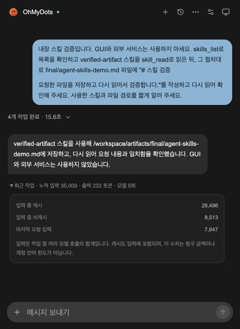

# 토큰 사용량 조사와 입력 축소

2026-10-06. 짧은 파일 검증 작업에서 표시된 `입력 123,753 / 출력 323`을 실제 실행 이벤트로 조사했다. 결과는 모델이 한 번에 123,753토큰을 읽었다는 뜻이 아니라 **6번의 모델 요청에 걸친 누적 입력**이었다. 그중 110,848은 캐시 입력, 12,905는 비캐시 입력이었다.

## 반복 입력이 커진 이유와 수정

1. **기본 코딩 지침 위에 제품 지침을 추가하고 있었다.** `thread/start.baseInstructions`에 OhMyDots의 전체 지침을 지정하도록 변경했다. GUI 제어권·격리 셸·외부 변경 확인·파일 검증 규칙은 제품 지침에 유지한다.
2. **Codex app-server가 개인 설정을 읽고 있었다.** 기존 `codex exec --ignore-user-config` 옵션은 app-server 실행 시 전달되지 않는다. `mcp_servers` 테이블에 dot을 추가하는 것만으로는 개인 MCP 서버가 제외되지 않았다. `config/read`로 서버 이름을 확인한 뒤 해당 임시 thread에서 개인 서버를 비활성화하고 private dot 서버만 명시적으로 구성한다. 개인 설정 파일과 로그인은 변경하지 않는다.
3. **호스트 Skill 목록도 명시적으로 제외할 필요가 있었다.** 호스트 탐색 차단 플래그를 전달해도 현재 설치된 CLI의 `skills/list`에는 108개, 그중 107개가 enabled로 조회됐다. 각 경로를 해당 thread의 `skills.config`에서 비활성화하자 첫 요청 입력이 추가로 11,842 → 6,360으로 줄었다. 앱의 `skills_list`/`skill_read`와 내장 스킬은 계속 사용한다.
4. **작은 작업에 항상 Skill을 찾을 필요는 없다.** 단순 파일 작성은 바로 작성·검증하고, 복잡한 절차나 사용자 요청이 있을 때 스킬을 사용하도록 지침을 조정했다. ID를 이미 알면 목록 조회도 생략할 수 있다.

호스트 메모리·추가 실행 기능도 자식 Codex 프로세스에서 비활성화한다. 설정과 Skill 메타데이터를 모델 입력이나 실행 로그에 복사하지 않는다. 인증 파일을 읽거나 별도 위치에 복사하지 않는다.

모델 호출 전 `mcpServerStatus/list`에서 **dot의 도구가 정확히 현재 Registry의 9개인지, 다른 MCP 서버가 도구를 노출하는지** 확인한다. 다르면 모델 호출 전에 중단한다. 이는 MCP 도구 목록 검사이며 GUI의 의미적 승인 문제 전체를 해결하는 기능은 아니다.

## 실제 비교

아래 네 실행은 모두 새 대화, 동일한 요청 문장, 동일한 provider/model 설정으로 진행했다. `skills_list → skill_read → artifact_write → artifact_read` 순서와 파일 내용 일치를 DB 이벤트에서 검증했다. 중간 단계도 함께 남겨 캐시 차이를 숨기지 않는다.

| 단계 | 첫 요청 입력 | 누적 입력 | 입력 중 캐시 | 입력 중 비캐시 | 출력 | 모델 사용량 보고 |
| --- | ---: | ---: | ---: | ---: | ---: | ---: |
| 변경 전 | 19,843 | 123,753 | 110,848 | 12,905 | 323 | 6회 |
| 제품 기본 지침 적용 | 15,660 | 81,509 | 63,872 | 17,637 | 234 | 5회 |
| 개인 도구·추가 기능 제외 | 11,842 | 62,419 | 48,512 | 13,907 | 224 | 5회 |
| 호스트 Skill 목록까지 제외 | **6,360** | **35,009** | **26,496** | **8,513** | **232** | **5회** |

최종 비교에서 누적 입력은 약 **72%**, 첫 요청 입력은 약 **68%**, 비캐시 입력은 약 **34%** 줄었다. 마지막 작업은 15.6초에 완료했다. 원본은 19.2초였지만 단일 실행 비교이므로 평균 성능이나 보장된 속도 개선으로 해석하지 않는다.

각 단계는 한 번씩 측정했다. 처음 6회에서 5회로 줄어든 모델 호출 수 차이도 누적 입력 감소에 포함된다. 캐시는 실행마다 달랐고, 중간 변경에서는 누적 입력이 줄어도 비캐시 입력이 늘었다. **토큰 감소율은 청구 금액·계정 한도 절감률이 아니다.** 잔여 한도나 금액은 추정하지 않는다. 모델 설정은 모두 비어 있는 계정 기본값이었고, 실제 모델 버전 ID를 별도로 확보한 비교는 아니다.

정제한 실행 ID·수치·동일 요청/결과 검사 결과는 [비교 JSON](research/token-usage-comparison.json)에 있다. 이 실험은 GUI·개인 계정 데이터·외부 전송을 사용하지 않았다. OpenAI API 실제 호출은 하지 않았다.

## 화면에서 읽는 방법

최근 사용량을 펼치면 다음이 표시된다.

- **누적 입력 / 출력:** 한 작업에서 모델이 보고한 총량.
- **입력 중 캐시 / 비캐시:** 입력 합계를 나눈 값. 둘을 다시 합치면 누적 입력이다.
- **모델 호출 수:** OpenAI는 SDK 보고값, Codex는 누적 입력 증가분과 last 입력이 일치하는 완료 보고를 센다. 중복 보고는 제외하고 누락 여부가 불명확하면 수치를 표시하지 않는다. 이전 기록의 호출 수를 임의 생성하지 않는다.
- **마지막 요청 입력:** Codex의 `tokenUsage.last.inputTokens`. 다음 요청의 context 길이나 context 최대 크기는 아니다.

## 검증과 남은 범위

- Python 전체 **50 passed**, 웹 기존 **13 passed**, TypeScript/Next production build, Ruff, diff-check 통과.
- 프로토콜 테스트: 제품 baseInstructions, 개인 MCP 비활성화와 private dot 구성, 호스트 Skill 경로 비활성화, 예기치 않은 호스트 도구가 있으면 모델 요청 미실행, 중복 사용량 보고 미집계, 비밀 설정값 비노출.
- 설치된 실제 Codex app-server에서 모델 호출 없이 도구 목록 검증도 수행했다. 최종 실제 Run은 dot 9개·다른 MCP 도구 0개·호스트 Skill 경로 108개 비활성화를 기록했고, 내장 스킬과 파일 검증을 완료했다.
- UI에서 과거 기록의 캐시/비캐시와 새 기록의 호출 수/마지막 입력을 확인했다. API 재시작 전 진행 Run이 없는 것을 확인했고 컴퓨터 컨테이너는 재생성하지 않았다.

현재도 한 요청에는 제품 지침·도구 정의·Codex 실행 context 등 기본 입력이 들어간다. 긴 대화의 길이 예산, Run 안의 스크린샷 이력 축소, provider thread 재사용은 별도 변경으로 남긴다. 이번에 전체 대화나 증거를 임의로 잘라내지는 않았다.
