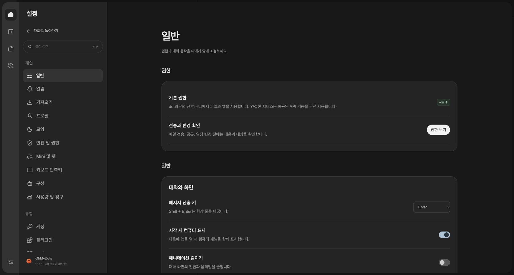
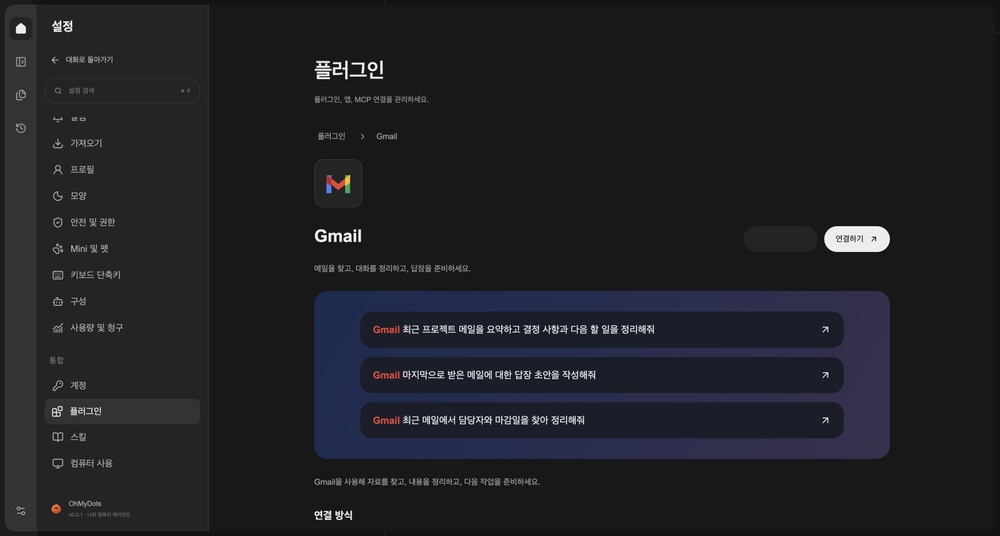
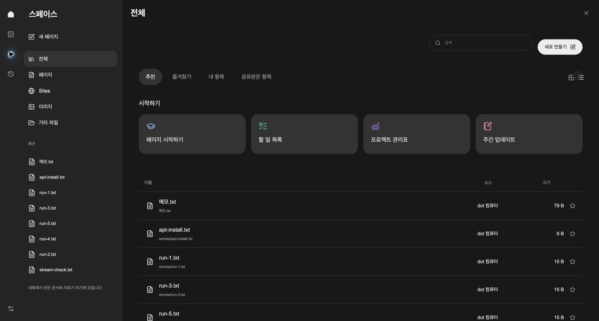
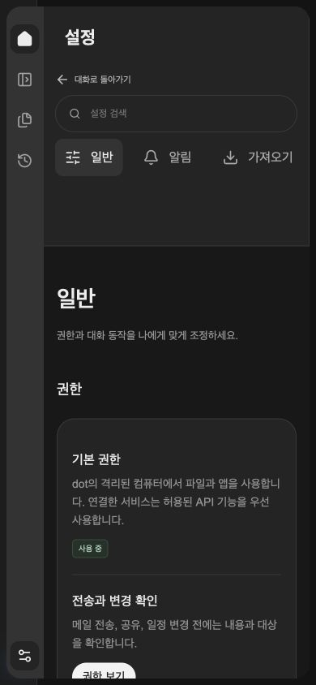
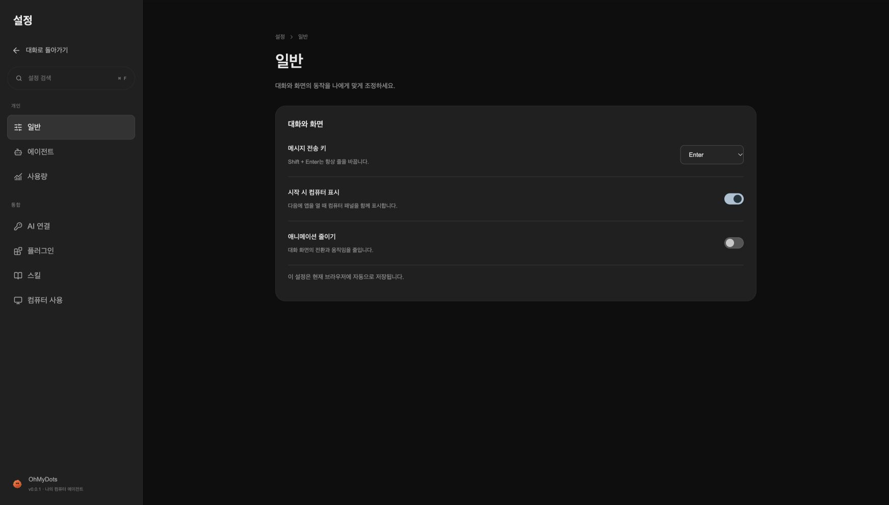
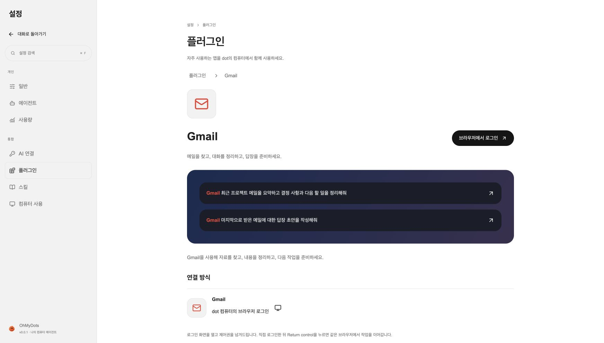
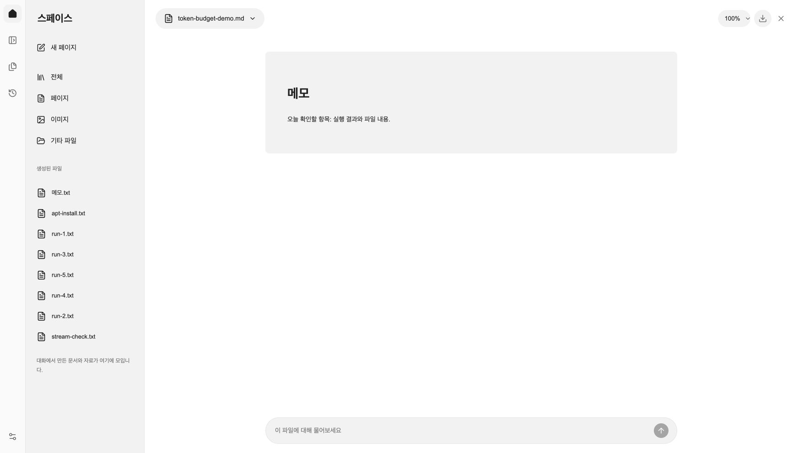
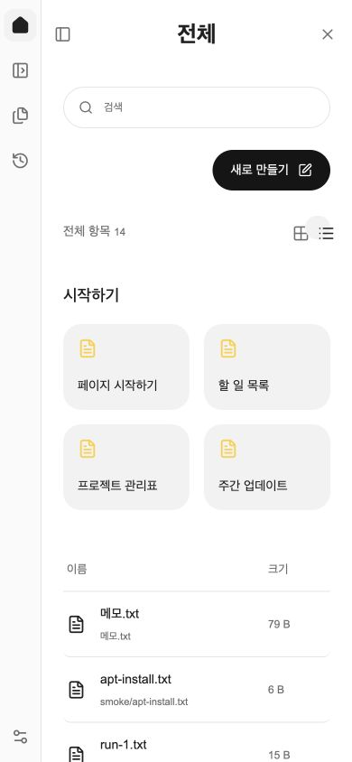

# 2026-10-07 추가 구현 및 검증

ChatGPT 참고 화면에 맞춰 외곽 레일, 지속되는 사이드바, 설정의 권한 카드와 개인/통합 메뉴, 플러그인 로고·상세·사용 예시, 스페이스 목록·즐겨찾기·미리보기를 보완했습니다. 실제 DOCX는 제목·문단·표로 미리보기하며 원본 페이지 배치는 재현하지 않습니다.

OAuth/API 연결과 Capability Resolver를 구현했습니다. API는 Gmail 검색·본문, Calendar 일정, Drive 검색·메타데이터, Slack 공개 채널 읽기를 지원합니다. 서버 OAuth 자격 증명이 없어 실제 계정 연결은 검증하지 않았습니다. 아래의 이전 기록에서 API 미구현 설명은 이번 변경 이전 상태입니다. 설정 절차와 한계는 [앱 연결 문서](../integrations.md)를 참고하세요.

Chrome localhost:3080에서 설정 메뉴와 Gmail 설정 필요 안내, 14개 실제 생성 파일, 텍스트 미리보기, 즐겨찾기의 새로고침 후 유지, 390×844 설정/스페이스의 가로 넘침 없음을 확인했습니다. Python 테스트 74개, 웹 테스트 15개, TypeScript 검사와 프로덕션 빌드가 통과했습니다. 최신 API·게이트웨이 재시작 후 UI HTTP 200 및 API ready 응답을 확인했습니다. 검증 후 원래 라이트 테마를 복원하고 테스트 즐겨찾기를 제거했습니다. 제공된 동영상의 Gmail·Take over·LibreOffice 작업 장면도 샘플 프레임으로 확인했습니다.

---

# 설정과 스페이스 UI 검증 — 2026-10-07

사용자가 제공한 ChatGPT 설정·Spaces·플러그인 스크린샷의 화면 구조를 기존 OhMyDots 기능에 적용했습니다. 네이티브 앱은 직접 접근할 수 없어 제공된 스크린샷과 접근 가능한 웹 화면을 기준으로 작업했습니다.

## 적용한 동작

- 설정: 개인/통합 메뉴, 검색, 넓은 콘텐츠 영역, 일반 설정과 기존 Codex/API 모델 선택기 유지.
- 플러그인: Gmail·Calendar·Drive·Slack 목록, 검색, 상세 소개, 작업 예시와 로그인 진입. 예시는 자동 실행 없이 채팅 초안으로 전달됩니다.
- 스페이스: 독립 전체 화면, 파일 종류/검색, 목록·격자, 최근 파일, Markdown·텍스트·이미지·PDF 미리보기, 다운로드, 배율과 파일 질문 초안.
- 모바일: 파일 탐색 패널과 파일 목록, 작은 화면에서 소스 열 생략. 다크/라이트 공통 테마 변수 사용.

## 실제 검증

localhost:3080 Chrome에서 일반 설정, plugin 검색, Gmail 상세, 예시 초안 전달, 14개 실제 생성 파일 목록, 파일 검색·격자 보기, Markdown 파일 미리보기와 파일 질문 초안 전달을 확인했습니다. 390×844에서 목록과 파일 종류 메뉴를 확인했습니다. 다크/라이트 화면을 캡처했습니다.

웹 테스트 15개 통과. TypeScript 검사 및 Next.js 프로덕션 빌드 통과. Docker 웹 이미지 빌드 및 로컬 웹 컨테이너 반영.

## 연결과 실행 경로

현재 앱 연결은 dot 컴퓨터에서 브라우저 로그인 화면을 열고 사용자에게 제어권을 전달하는 방식입니다. API/OAuth 직접 연결은 구현하지 않았으며 UI에도 표시합니다. 로그인 버튼의 실제 인증은 사용자가 완료해야 하며, 이번 검증에서는 로그인이나 외부 메시지 발송을 수행하지 않았습니다.

장기 구조는 Capability Resolver가 연결 상태와 가능한 기능을 확인하고 Integration 도구를 우선 선택한 뒤 지원되지 않는 작업에 Computer Use를 선택하는 방식이 적합합니다. 이 UI 변경은 해당 라우터나 OAuth 실행기를 구현한 변경은 아닙니다.

## 화면

